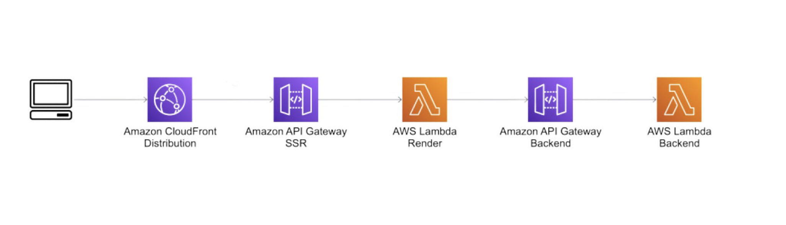
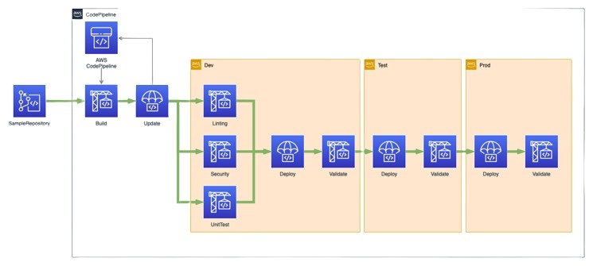
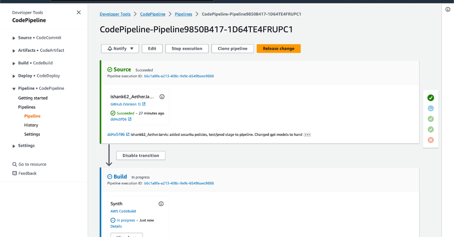
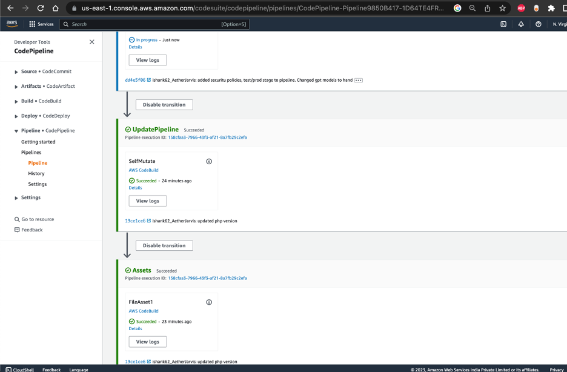
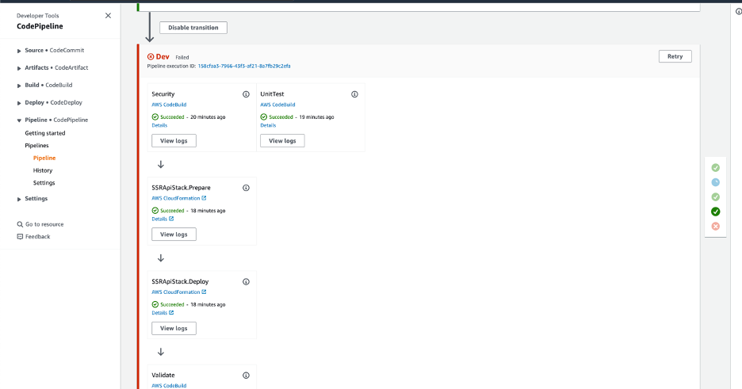
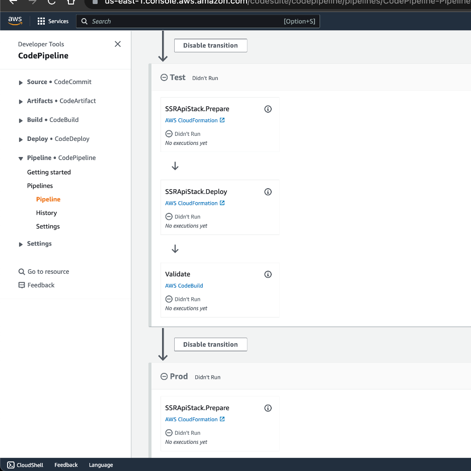
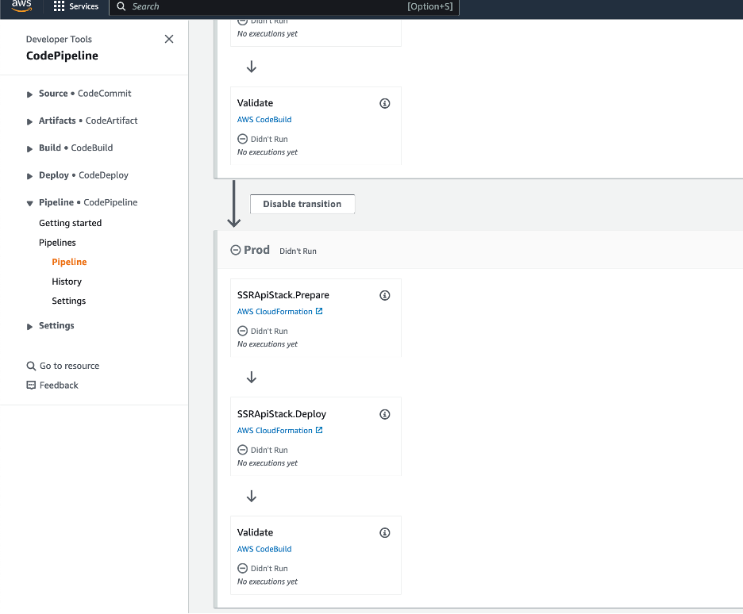
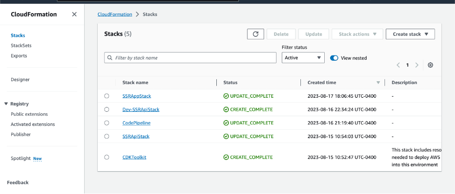

# AetherJarvis

## ChatGpt Scalable Architecture using Serverless Architecture, Server Side Rendering, Edge location Caching/distribution for high availability & performance deployed using Infrastructure as Code(IAC).

Running version of the application can be viewed on the following url:-  
**Demo Url - https://d8m7lywmomzjq.cloudfront.net**

This solution uses AWS services like  `Amazon CloudFront`, `Amazon API Gateway`, `AWS Lambda`, `Lambda@Edge`, `Amazon S3`, `Cloudformation`, `AWS Secrets Manager`, `AWSCodePipeline`, `AWSCodebuild`,`AWSCodeDeploy` and`AWSCodeCommit` . It creates a fully serverless Server-Side Rendering (SSR) implementation, which automatically scales according to the workload. To deploy this solution and to provision the AWS resources, I use the AWS Cloud Development Kit (CDK).

The React app is rendered server-side with a Lambda@Edge function. This scenario is similar but rendering happens at edge locations. The requests to cloudfront are handled by the Lambda@Edge function. This sends requests to the backend and returns a static HTML page.
Secrets OpenApikey, github-token are stored in AWS Secrets Manager.

## Features
- User-friendly interface for making requests to the OpenAI API
- Responses are displayed in a chat-like format
- Select Models (Create Image model: `DALL-E`, Chat/Code model: `GPT-3.5-TURBO`, Language model: `TEXT-DAVINCI-003`) based on your needs
- Highlight code syntax

## Techstack
- `Reactjs`
- `Nodejs`
- `Typescript`
- `Javascript`

## AWS Services
- `CloudFront`
- `API Gateway`
- `AWS Lambda`
- `Lambda@Edge`
- `Cloudformation`
- `AWS CDK`
- `Amazon S3`
- `AWS Secrets Manager`
- `AWSCodePipeline`
- `AWSCodebuild`
- `AWSCodeDeploy`
- `AWSCodeCommit`

## Application Architecture, IAC & CI/CD

This pattern defines a re-usable CI/CD pipeline written using `AWS CDK v2 (CDK)`. The pipeline includes tests to validate the security of your 3rd party libraries and ensures expedited as well as automated release in desired environments. You can increase the overall security of your applications by putting them through a validation process.

`CloudFormation` is an AWS service for provisioning infrastructure as code (IaC) through the use of YAML or JSON templates. It uses stacks to logically group various AWS services into a collection, which can be managed as a single unit. These stacks can create things like a AWS CodeCommit repository and a AWS CodePipeline CI/CD pipeline.

The pipeline is triggered by a change in the Github repository. In the beginning it builds artifacts, updates itself and starts the deployment process. The resulting pipeline deploy solution to three independent environments:

Dev - code check, active development environment
Test - integration and regression test environment
Prod - production environment

In the Dev stage there are 3 steps `Linting`, `Security` and `Unit Tests`. These run in parallel to speed up the process. To ensure the pipeline only provides working artifacts, it will be stop executing whenever a step in the process fails. After a `Dev stage` deployment, the pipeline runs `validation tests` verifying the results. In case of success, the pipeline will then deploy to the `Test environment` containing `post-deployment validation`. The final step is to deploy the artifacts to the `Prod environment`.

## CodePipeline in Action

After successful initial deployment, you should have complete CI/CD pipeline with a `master` branch of `ishank62/AetherJarvis` as a Source branch. As soon as you commit changes to the `main` branch the AWS CodePipeline will trigger and execute following sequence of actions:

1. Get your code from the AWS CodeCommit repository
2. Build your code
3. Update the pipeline itself (SelfMutate)
4. Execute 3 parallel jobs for `Linting`, `Security` and `UnitTests` checks
5. In case of success the pipeline will deploy the Main stack with Infrastructure as Code example
6. Execute post-deployment check for deployed resources

## Cloudformation Stacks

